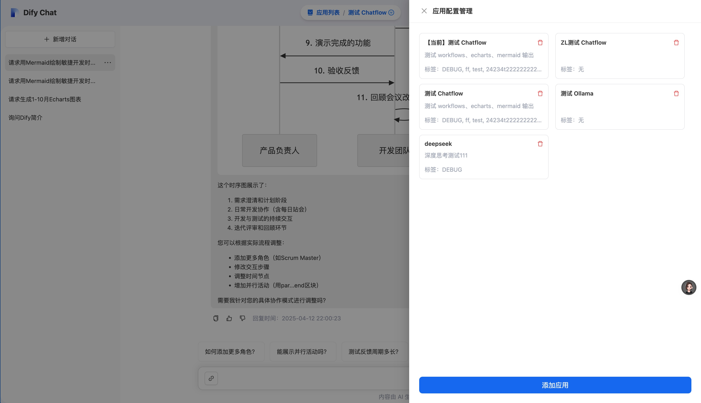
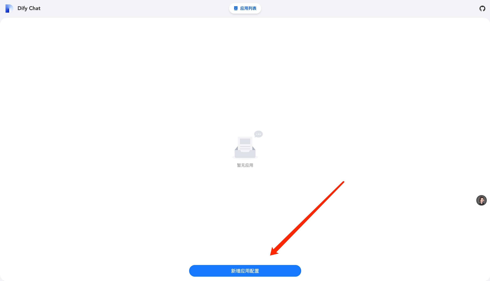
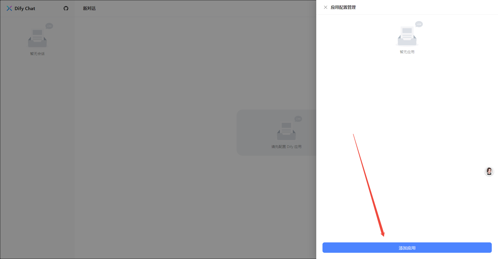
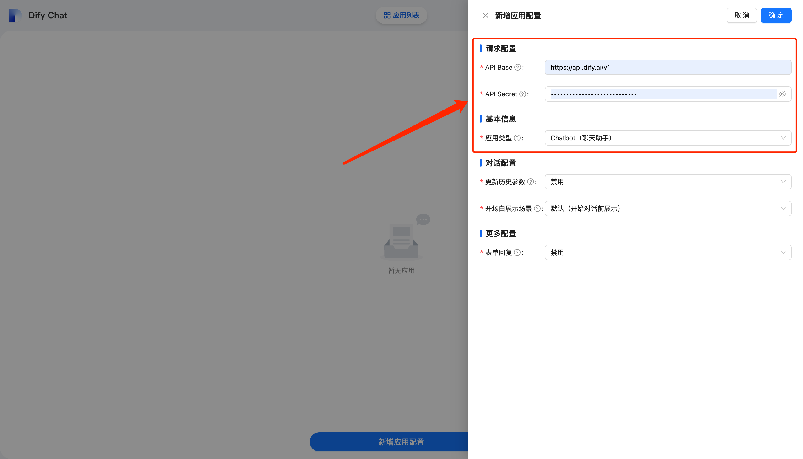
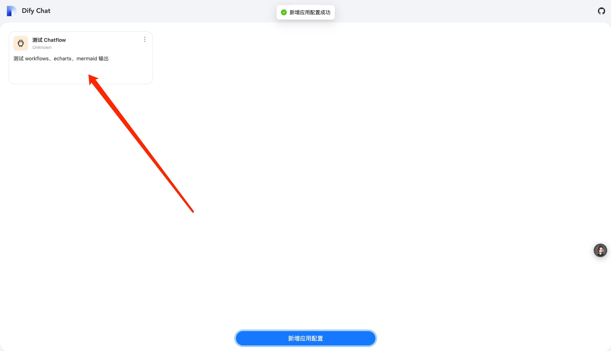
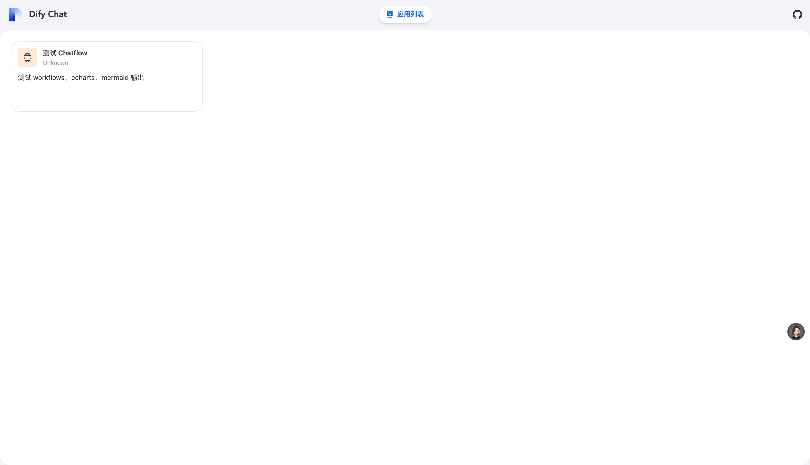
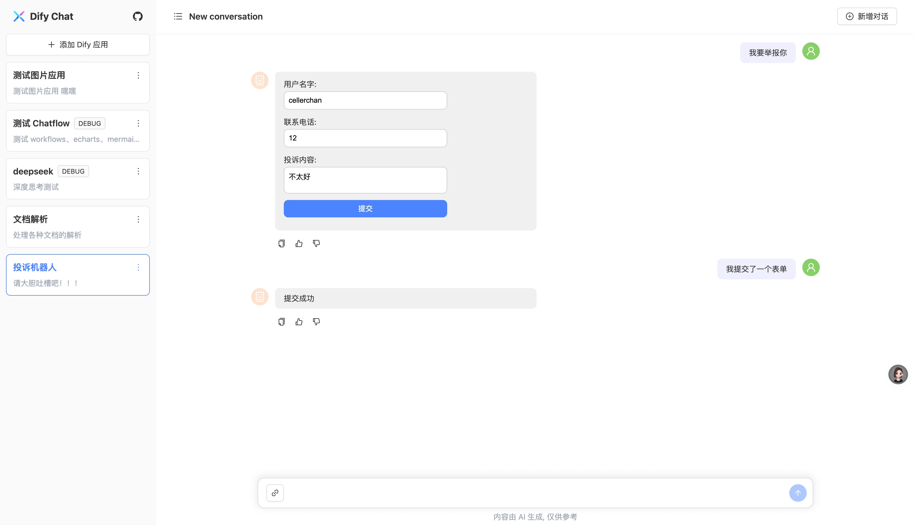

# Dify Chat Web

一个基于 Dify API 的 AI 会话 Web APP, 适配深度思考、Dify Chatflow/Workflow 应用、Agent 思维链输出信息。

如果你觉得这个项目还不错的话，请动动你的小手指点个 Star 吧～

## Repobeats


## 运行截图

`<think>` 标签（DeepSeek 深度思考）：


Chatflow 工作流：


知识库引用链接：


`Echarts` 图表：


`Mermaid` 图表：


文档处理：


单应用模式：


多应用模式配置管理：



回复表单：


移动端支持：


## 特性

- 📦 开箱即用：仅需配置 API 密钥即可开始使用
- 💬 随心所欲：支持单应用/多应用模式，满足不同企业级业务场景
- 💃 灵活部署：自身无任何后端依赖，可无缝接入 Dify Cloud 及私有化部署的 API 服务
- 🚀 高效集成：提供高度可复用的 React 组件，加速开发进程
- 🎨 风格适配：支持深度自定义样式与主题，轻松契合业务系统独特风格

## 技术栈

- React v18
- Ant Design v5
- Ant Design X v1
- Rsbuild v1
- Tailwind CSS v3
- TypeScript v5

## 运行环境

开发/生产构建环境要求：

- Node.js v18.17.1+
- pnpm v8.x

> 注意：本应用使用了 pnpm workspace 来实现 Monorepo 管理，其他包管理工具可能无法正常工作，请先确保你的环境满足以上要求。

## 开始使用

本项目支持两种开箱即用的使用方式：

- 单应用模式: 全局只需要一个 Dify 应用
- 多应用模式: 支持用户在界面上添加多个 Dify 应用

## 0. 获取 Dify 应用配置

无论使用哪种模式，我们都需要对接 Dify API，你需要在 Dify 控制台获取几个关键变量：

| 变量 | 说明 |
| --- | --- |
| API Base | Dify API 请求前缀, 如果你使用的是 Dify 官方提供的云服务，则为 `https://api.dify.ai/v1` |
| Api Key | Dify API 密钥，用于访问对应应用的 API, Dify 应用和 API 密钥是一对多的关系 |

进入 Dify 的应用详情，点击左侧的 `访问 API`：


`API 服务器` 后展示的域名即为 `API Base` 变量的值。

点击右侧的 `API 密钥` 按钮，即可看到 API Key 的管理弹窗：


你可以选择创建一个新的 API Key，或者复制现有的 API Key。


完成以上步骤后，我们将会得到如下信息：

- API Base: `https://api.dify.ai/v1` OR `${SELF_HOSTED_API_DOMAIN}/v1`
- API Key: `app-YOUR_API_KEY`

### 1. 单应用模式

如果你全局只需要一个 Dify 应用, 不想让用户手动修改，可以使用单应用模式。


只需简单修改 `src/App.tsx` 中 `DifyChatProvider` 的属性即可：

```tsx
export default function App() {
	return (
		<DifyChatProvider
			value={{
				// 修改为单应用模式
				mode: 'singleApp',
				// 用户id，可以获取业务系统的用户 ID，动态传入
				user: USER,
				// 单应用模式下，需要传入 appConfig 配置
				appConfig: {
					requestConfig: {
						apiBase: '上一步中获取到的 API Base',
						apiKey: '上一步中获取到的 API Key',
					},
				},
			}}
		>
			子组件
		</DifyChatProvider>
	)
}
```

### 2. 多应用模式

如果你需要支持用户在界面上配置以及/或者切换多个 Dify 应用，多应用模式也是开箱即用的。

#### 2.1. 在界面上添加 Dify 应用配置

如果之前没有存量数据，第一次进入页面时会展示缺省状态，你需要点击页面右上角的 "应用配置管理" 按钮：



会弹出应用配置管理抽屉，点击下面的 "添加应用" 按钮：



即可打开添加配置抽屉：


依次填入我们在上一步中获取的信息：



点击确定按钮，提示 “添加配置成功”，在应用列表中会多出一条数据：



主界面也会默认切换到刚刚添加的应用，加载对话列表，默认渲染第一条对话的历史记录：


#### 2.2. 自定义应用配置管理 (按需)

**默认实现说明**

为方便演示, 本项目默认使用 Localstorage 进行应用配置管理。

但实际在生产环境中，我们会将应用数据存储在服务端，此时就需要接入后端服务来实现应用配置管理。

为方便使用方自定义, 应用配置管理的服务是通过 `src/App.tsx` 中的 `DifyChatProvider` 组件注入的:

```tsx
// src/App.tsx
import { DifyChatProvider } from '@dify-chat/core'

import DifyAppService from './services/app/localstorage'

export default function App() {
	return (
		<DifyChatProvider
			value={{
				appService: new DifyAppService(),
			}}
		>
			子组件
		</DifyChatProvider>
	)
}
```

在子组件中，会使用 `useDifyChat` 钩子获取 `appService` 实例并调用相关方法进行应用配置的管理。

**自定义后端服务示例**

在 `"./services/app/restful.ts"` 文件有一个 Restful API 的最简实现, 你可以根据下面的步骤来进行体验：

1. 运行 `pnpm --filter dify-chat-app-server start` 启动后端服务
2. 将上面的 `DifyAppService` 导入路径换成 `"./services/app/restful"`
3. 运行 `pnpm dev` 启动前端应用, 访问 `http://localhost:5200/dify-chat`

**自定义后端服务实现**

如果需要自定义你的后端服务，请遵循以下步骤：

首先，参考 `packages/server`，实现以下接口：

- 获取 App 配置列表
- 获取 App 配置详情
- 添加 App 配置
- 更新 App 配置
- 删除 App 配置

然后在 `src/services/app` 中新建一个文件，只需要继承抽象类 `DifyAppStore` 并实现它的所有方法, 调用在上述服务中对应的接口即可。

#### 2.3 禁用应用配置管理功能

当你不想让用户在界面上管理应用配置, 而是仅提供一个应用列表供用户切换，可以在 `src/App.tsx` 中添加一个配置项即可：

```tsx
// src/App.tsx
import { DifyChatProvider } from '@dify-chat/core'

import DifyAppService from './services/app/localstorage'

export default function App() {
	return (
		<DifyChatProvider
			value={{
				enableSetting: false,
			}}
		>
			子组件
		</DifyChatProvider>
	)
}
```

此时，页面上就只会展示应用切换按钮, 用户仍然可以切换应用，但设置入口被隐藏：



### 3. 跨域处理

Dify Cloud 以及私有化部署的 Dify 服务本身均支持跨域请求，无需额外处理，但如果你的私有化部署环境还存在额外的网关层，且对跨域资源访问有严格的限制，可能就会导致跨域问题，处理方式如下：

#### 3.1. 生产构建模式(pnpm build)

在你的网关层的响应 Header 处理中，增加 `Access-Control-Allow-Origin` 字段，允许 Dify-chat 应用的部署域名访问，以 nginx 为例：

```bash
# nginx.conf
server {
  listen 443;
  server_name dify-chat.com # 这里换成你的前端部署域名

  location / {
    add_header Access-Control-Allow-Origin https://dify-chat.com; # 这里换成你的前端部署协议+域名
    add_header Access-Control-Allow-Methods 'GET, POST, PUT, DELETE, OPTIONS';
  }
}
```

#### 3.2 本地开发模式(pnpm dev)

在项目根目录新建 `.env.local` 文件，添加以下内容：

```bash
# .env.local
DIFY_API_DOMAIN=https://api.dify.ai # 换成你的 API 部署域名
DIFY_API_PREFIX=/v1 # API 访问前缀，如果你没有对 Dify 进行魔改的话，一般就是 /v1
```

然后，你需要在界面上修改上一步中 API Base 的配置：

- 修改前: `${SELF_HOSTED_API_DOMAIN}/v1`
- 修改后: `/v1`

在运行 `pnpm dev` 时，Rsbuild 会自动读取 `.env.local` 文件中的环境变量，设置正确的 `server.proxy` 实现本地代理，可以访问 `rsbuild.config.ts` 文件查看详情。

### 4. 支持表单

Dify 支持通过 `jinja2` 来配置回复表单供用户填写，本项目也支持了对应的功能。

> 注意：你需要自行在 Chatflow 中对 `sys.query` 进行正确的逻辑处理，区分普通消息、触发表单的消息及提交信息。

默认情况下，在用户点击表单的提交按钮后，会将表单的值对象作为消息发送给 Dify 应用，同时会在消息列表中展示，提交消息的示例文本：

```json
{
	"username": "cellerchan",
	"phone": "13012345678",
	"content": "我要举报你",
	"isFormSubmit": true
}
```

其中，`isFormSubmit` 字段用于标识这是一个表单提交的消息, 你可以在 Chatflow 编排的条件分支中使用它来进行判断。


如果你不想展示具体的表单值对象，而是需要自定义发送的消息文本，可以按照下面的指引，在应用配置中进行配置（此配置只影响界面展示，实际提交到 Dify Chatflow 开始节点的仍然是用户填写的表单值 json 字符串）。

**多应用模式**

在添加/更新应用配置弹窗中填写字段：

- 表单回复 - 设置为 "启用"
- 提交消息文本 - 用于替换表单值对象的文本


**单应用模式**

在入口文件中，添加对应的属性即可：

```tsx
export default function App() {
	return (
		<DifyChatProvider
			value={{
				mode: 'singleApp',
				user: USER,
				appConfig: {
					requestConfig: {
						apiBase: '你的 API Base',
						apiKey: '你的 API Secret',
					},
					answerForm: {
						enabled: true,
						feedbackText: '我提交了一个表单',
					},
				},
			}}
		>
			子组件
		</DifyChatProvider>
	)
}
```

按照如上配置后，效果如下：



## 本地开发

安装依赖:

```bash
pnpm install
```

启动开发服务器：

> 支持子包热更新，无需提前构建

```bash
pnpm dev
```

构建生产版本：

```bash
pnpm build
```

预览生产版本：

```bash
pnpm preview
```

## Roadmap

- [x] 支持多个会话切换
- [x] 支持运行时用户自定义 Dify API 配置
- [x] 移动端适配
- [x] 消息更新时自动滚动到最底部
- [x] 拆分独立组件库，方便二次开发
- [x] 会话操作
  - [x] 支持会话重命名
- [x] 消息发送区域功能
  - [x] 支持发送图片
  - [x] 支持发送其他类型的文件
  - [x] 支持打断输出
  - [ ] 支持语音输入转文字
- [x] 消息内容渲染
  - [x] 支持深度思考标签展示（如 DeepSeek-R1 的输出）
  - [x] 支持工作流信息展示
  - [x] 支持思维链展示
  - [x] 支持知识库引用列表展示
  - [x] 支持图片展示
  - [x] 支持图片放大查看
  - [x] 支持 `Echarts` 渲染
  - [x] 支持数学公式渲染
  - [x] 支持文件卡片渲染
  - [x] 支持 `Mermaid` 渲染
- [x] 消息内容交互
  - [x] 支持内容复制
  - [x] 支持点赞/点踩
  - [x] 支持消息文件点击下载
  - [x] 支持回复表单展示和提交
  - [ ] 支持文字转语音
- [x] 支持多应用模式
  - [x] Localstorage 实现
  - [x] Restful API 实现
  - [x] 支持自定义后端服务
  - [x] 配置和切换功能分离，支持隐藏配置入口
- [x] 支持单应用模式
  - [ ] 支持用户在界面上变更配置
- [ ] 子包发布
  - [ ] 发布 `@dify-chat/core` 包
  - [ ] 发布 `@dify-chat/helpers` 包
  - [ ] 发布 `@dify-chat/api` 包
  - [ ] 发布 `@dify-chat/components` 包
- [ ] 国际化
- [ ] 支持单个会话视图
- [ ] 支持消息触顶/触底自动分页加载
- [ ] 支持回复重新生成、父级消息
- [ ] 支持夜间模式
- [ ] 支持自定义主题
- [ ] 补充不同类型应用场景的最佳实践
- [ ] 容器化部署支持

## License

[MIT](./LICENSE)

## Star History

[](https://www.star-history.com/#lexmin0412/dify-chat&Date)
